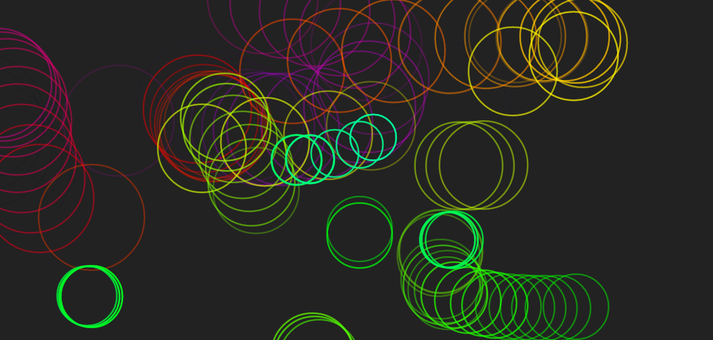

# Spacebrew Jam Session

Our awesome project from the ITP Spacebrew Workshop jam session today!

We created a collaborative (messy) drawing app for our in-class jam, using Spacebrew, d3.js, and the iOS touch event API. Anyone can log into the drawing interface on their iPhone, and view their own, and others' drawings interactively 

Drawing Interface: <http://draw.jann.ae>  
Viewing Interface: <http://draw.jann.ae/view>

## Source Credit / Tech Used

* [Spacebrew!](http://docs.spacebrew.cc/)
* [d3.js](http://d3js.org)
* [Node <3](http://nodejs.org/)

